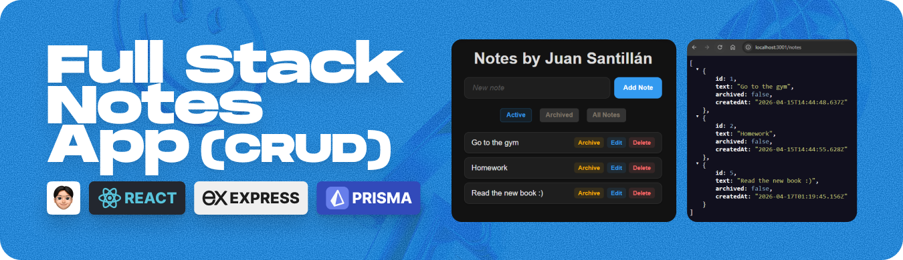

<div align="center">
    <a href="" target="_blank">
    
    </a>
  <br />
</div>

# Full Stack Notes App (CRUD)

## 🧠 Description

This project is a web-based note management application that allows users to organize their ideas through a system of creation, editing, and archiving.

The project is structured as a pure **Single Page Application (SPA)** with a clean separation of concerns:

- **`frontend/`**: Built with **React**, managing UI state, filtering logic, and asynchronous API calls.
- **`backend/`**: A **Node.js/Express** server implementing a layered architecture:
  - **Routes**: Defines the API endpoints.
  - **Controllers**: Handles request validation and HTTP responses.
  - **Services**: Manages business logic and database interactions via **Prisma ORM**.
  - **Database**: Uses a local **SQLite** file for persistence.

---

## 👨‍💻 Author

**Juan Santillán**
| Front-End Developer and creative enthusiast.

---

## 🚀 Quick Start (Setup & Execution)

The entire application can be set up and started with **one single command** using the provided automation script.

### One-Command Rule:

Open the terminal in the project root directory and run:

### Mac / Linux / Windows (Git Bash, WSL):

```bash
sh ./run.sh
```

### Windows (CMD / PowerShell):

```bash
run.bat
```

**What this command does automatically:**

- Installs all dependencies for both Frontend and Backend.
- Creates and configures environment variables (`.env`).
- Initializes the SQLite database and syncs the schema.
- Starts the Backend API (Port 3001) and the Frontend (Port 5173) simultaneously.

---

## 🛠️ Implementation

Currently, the project successfully covers the following features:

- **Notes CRUD**: Creating, editing, and deleting notes.
- **Archived Status**: Ability to archive and unarchive notes.
- **Dynamic Listing**: Display filters for active notes and archived notes.
- **Real Persistence**: Data stored in a relational database using an ORM.

---

## 🛠️ Technologies Used

> The following technologies were used in this project.

<div align="left">
  
  
  
  
  
  
</div>

- **Node.js**: `v18.x.x`+
- **Frontend**: React 18, Vite 6
- **Backend**: Express 5, Prisma 6
- **Database**: SQLite
